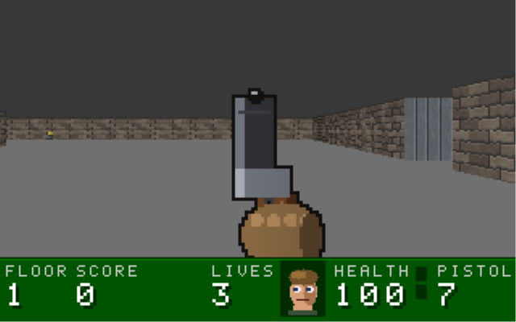
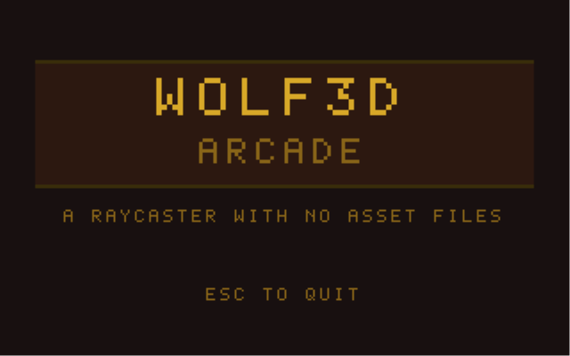
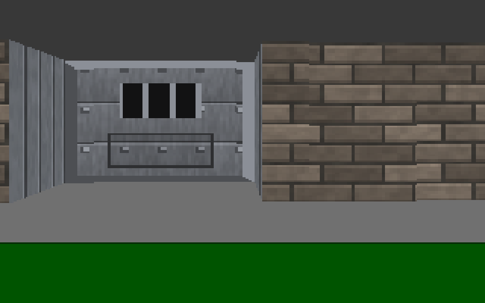
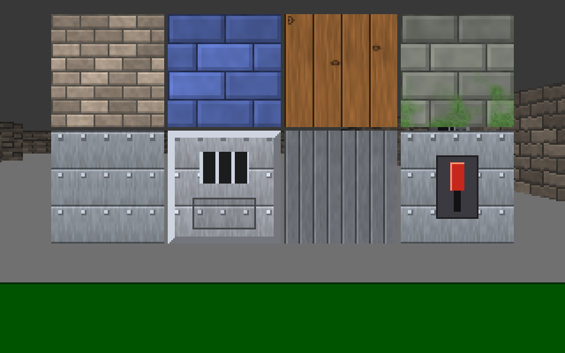
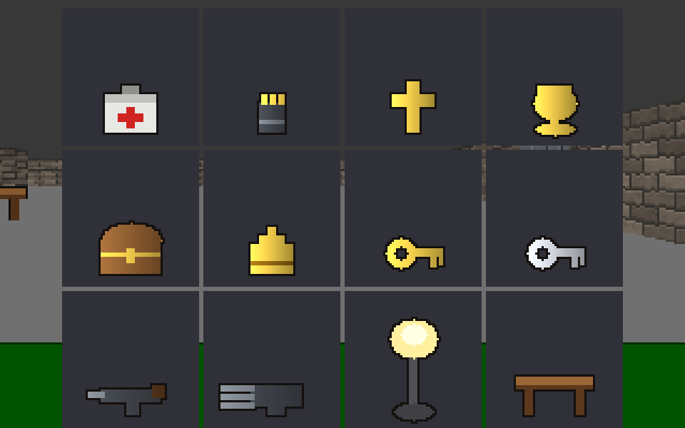
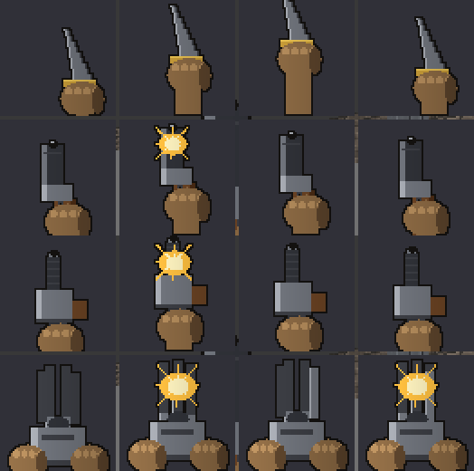

# Wolf3D Arcade

A from-scratch Wolfenstein 3D-style first-person shooter in C++ — a software
raycaster with no engine, no game libraries, and no asset files.


[](https://github.com/thompgt/wolf3d-arcade/actions/workflows/ci.yml)

> Status: **Phase 7 complete** — raycaster, procedural textures, doors and
> secrets, billboard sprites, enemy AI, weapons and the HUD. Level 1 plays
> start to finish: walk it, open doors, shove pushwalls, collect pickups,
> fight the guards with four weapons, and reach the exit for a tally. The
> modern abilities layer is next. See [WORKPLAN.md](WORKPLAN.md).



---

## Why this matters

Modern graphics work happens behind an API. You hand a scene to a GPU and a
driver decides what a pixel is. That is the right trade for shipping a game
and the wrong one for understanding how any of it works: the interesting
parts — perspective, occlusion, sampling, the sim/render split — are the
parts the abstraction hides.

A raycaster is the smallest complete counter-example. Every pixel on screen
here is computed by code in this repository and written into a plain array of
`uint32_t`. There is no depth buffer you did not write, no texture sampler
you did not write, no scene graph, and no frame pacing you did not decide.
Getting a convincing 3D scene out of that constraint forces the fundamentals
into the open:

- **Perspective is arithmetic, not magic.** Wall height falls out of one
  division by a distance — and using the ray's own length instead of its
  projection onto the view axis is the difference between a flat wall and a
  fisheye bulge. You see the bug on screen the moment you get the maths wrong.
- **Occlusion has to be designed.** Walls are solved per column by
  construction, but a guard standing half-behind a doorway only works because
  the wall pass records a per-column depth and the sprite pass tests against
  it. Hidden-surface removal stops being a checkbox and becomes a decision.
- **Simulation and rendering are different clocks.** The world steps at a
  fixed 60Hz with an accumulator, and a pass that steps it zero times sleeps
  out the rest of the tick rather than redrawing an identical frame. That
  split — and the input latch that stops a keystroke falling between two
  ticks — is the same problem every real-time system has, in miniature and
  unobscured.
- **Layering is load-bearing, not decorative.** `render/` never makes game
  decisions, `game/` never writes pixels, `platform/` is the only code that
  includes `windows.h`. That boundary is what lets 183 headless assertions
  test doors, AI, hitscans and HUD layout with no window and no input at all.

There is also a licensing lesson baked in. Wolfenstein 3D's art is
copyrighted and not distributable, so **every** texture, sprite, weapon frame
and font glyph here is generated by code at startup — value-noise brickwork,
parametric guard poses, an 8x8 bitmap font written as binary literals. The
repository is self-contained by construction: clone it, build it, play it.

## Skills demonstrated

**Language and tooling**
- Modern C++17: value semantics, `std::array`/`std::vector` ownership,
  `unique_ptr` for a multi-megabyte object that cannot live on the stack,
  `constexpr` configuration, enum-class-driven state machines.
- CMake as the source of truth for the build, with a `Makefile` (automatic
  header-dependency tracking via `-MMD -MP`) and a make-free `build.bat` kept
  as conveniences, and CI that builds all three so they cannot drift.
- Built with `-Wall -Wextra -Wpedantic`; statically linked deliberately
  (`-static -static-libgcc -static-libstdc++`) because a dynamically linked
  MinGW binary trips Windows Defender heuristics and silently fails to launch.

**Graphics and rendering**
- DDA grid traversal raycasting with perpendicular-distance correction.
- Perspective-correct texture mapping per column: `texX` from the hit
  fraction with correct mirroring, `texY` stepped from the *unclamped* column
  top so tall walls do not swim.
- Per-column depth buffer, and billboard sprites clipped against it column by
  column, sorted back-to-front by squared distance.
- Procedural texture synthesis: seeded xorshift PRNG plus tiling value noise,
  so builds are byte-for-byte reproducible and textures repeat seamlessly.
- Parametric sprite generation — 49 frames per enemy type from one
  head/torso/legs/gun routine driven by eight view buckets.
- Alpha-free transparency using the unused top byte of a Win32 BI_RGB DIB, so
  pure black stays a usable colour.
- Banded (not smooth) distance shading, shared by walls and sprites so
  nothing floats against its background; palette-shift-style screen washes
  implemented as a lerp toward a colour rather than an additive blend.

**Systems and game programming**
- Fixed-timestep accumulator loop decoupled from render rate, with a clamp so
  a stalled window cannot fast-forward the world, and frame pacing that sleeps
  to the next tick boundary instead of busy-blitting duplicate frames.
- Sticky, tick-consumed input edges — one keystroke produces exactly one
  action regardless of the frame-to-tick ratio.
- Circle-vs-grid collision resolved one axis at a time, which is what makes
  the player slide along a wall instead of sticking to it.
- Enemy AI as an explicit state machine with FOV cones, line-of-sight rays,
  noise propagation and distance-scaled hitscan accuracy.
- Data-driven tuning tables: guard vs SS, and knife vs pistol vs machine gun
  vs chaingun, are rows of numbers rather than parallel implementations.
- Explicitly seeded AI and weapon-spread generators: the self-test pins a
  fixed seed so a failing check reproduces exactly instead of being flaky,
  while the game seeds from the clock at `startLevel()` so replaying a fight
  is not a replay of the same dice.
- Raw Win32: window and message pump, `WM_INPUT` raw mouse for mouselook,
  high-resolution timing, `StretchDIBits` present.
- A headless `--selftest` harness: 183 assertions over level, doors, locked
  doors, secrets, raycasting, items, AI, hitscans, weapons, tallies, the face
  portrait and HUD text metrics — and over the renderer itself, which is
  rendered from a fixed camera pose and checked for frame determinism, depth
  buffer agreement, near-plane sanity and billboard occlusion.

## Architecture

Three layers with a strict one-way dependency: `platform/` knows about
Windows, `render/` knows about pixels, `game/` knows about rules. Nothing
points back up.

```
                 ┌──────────────┐
   keys, mouse   │  main.cpp    │   60Hz accumulator loop
   ───────────►  │  frame loop  │   ────────────────────►  present
                 └──────┬───────┘
                        │
       ┌────────────────┴────────────────┐
       ▼                                 ▼
┌─────────────┐                   ┌─────────────┐
│   game/     │   world state     │   render/   │   pixels
│  Map        │ ────────────────► │  Raycaster  │
│  Player     │   (read-only)     │  Billboards │
│  Items      │                   │  HUD        │
│  Enemies    │                   └──────┬──────┘
│  Weapons    │                          ▼
└─────────────┘                   ┌─────────────┐
                                  │ Framebuffer │  320x200 ARGB
                                  └──────┬──────┘
                                         ▼
                                  ┌─────────────┐
                                  │  platform/  │  StretchDIBits ×3
                                  └─────────────┘
```

### Models

The "models" in this project are the world and rendering data models — the
handful of structs everything else is expressed in terms of.

| Model | Where | What it represents |
| --- | --- | --- |
| `MapCell` { `TileKind`, `tex` } | `game/map.h` | One grid cell. Kind is what it *is* (Empty, Wall, Door, DoorGold, DoorSilver, Pushwall, ExitSwitch); `tex` is an index into the generated texture set. Levels are authored as ASCII art and parsed into this. |
| `Door` | `game/map.h` | A slab: tile, lock kind, derived orientation (`spansX`, inferred from neighbouring walls at load time), state (Closed/Opening/Open/Closing), `openness` 0..1 and an auto-close hold timer. |
| `Pushwall` | `game/map.h` | A secret in motion. Once shoved it has left the tile grid, so it carries a world-space box position and a travel direction instead of tile coordinates. |
| `Spawn` { `SpawnKind`, tile } | `game/map.h` | Where actors, pickups and decor belong. The map records placement; the systems that own them do the spawning. |
| `Player` | `game/player.h` | Position plus the raycaster's camera basis: a direction vector and a perpendicular plane vector whose length encodes the FOV, so a screen column is `dir + plane * cameraX`. Also the inventory, health, ammo and score. |
| `Item` { pos, sprite, `ItemKind`, blocking, taken } | `game/items.h` | Pickups and scenery. Billboards, so no tile footprint — blocking scenery gets its own circle test, because a solid tile would also stop rays. |
| `Enemy` | `game/enemy.h` | Position, angle, type, `EnemyState`, health, state/fire/anim timers, patrol heading, alerted flag. Both types run the same machine; `EnemyTuning` supplies the differences. |
| `EnemyTuning` / `WeaponTuning` | `game/enemy.h`, `game/weapons.h` | The data half of "same machine, different numbers": health, speeds, ranges, reaction and fire intervals, damage bands, spread, ammo cost, noise radius. |
| `RayHit` | `render/raycast.h` | The result of one traversal: perpendicular distance, cell, which edge was crossed, `wallX` fraction across the face, and flags for door slab / jamb / pushwall. Shared by rendering, line-of-sight and hitscans so all three agree about the world. |
| `Billboard` { x, y, `const Sprite*` } | `render/sprites.h` | One camera-facing image. It carries the frame, not an index — an enemy's frame depends on facing, animation and state, and the renderer has no reason to know which set it came from. |
| `Sprite` | `render/sprite.h` | A 64x64 `uint32_t` frame, transparency marked in the DIB's unused top byte. |
| `HudState` | `render/hud.h` | The plain struct the status bar draws from. It can be told health is 12; it cannot ask whether you are about to die. |
| `Framebuffer` | `core/framebuffer.h` | The 320x200 ARGB buffer and its primitives (`clear`, `put`, `vline`, `fillRect`, `washRows`). Everything lands here. |
| `Key` / `Platform` | `platform/win32_app.h` | Logical actions decoupled from scancodes, plus held/latched-press state and the raw-mouse delta. |

### Layout

```
src/
  main.cpp              frame loop, fixed 60Hz timestep
  selftest.h|cpp        headless assertions (--selftest)
  core/
    config.h            resolution, tick rate, FOV, texture size
    framebuffer.h|cpp   the pixel buffer and its primitives
    bmp.h|cpp           framebuffer -> .bmp dump (F12)
  platform/
    win32_app.h|cpp     window, input, timing, blit (only Win32-aware code)
  render/
    raycast.h|cpp       DDA wall casting and the depth buffer
    textures.h|cpp      procedural wall and door textures
    sprite.h            the 64x64 frame and its drawing primitives
    sprite_set.h|cpp    pickups and scenery
    actor_sprites.h|cpp guards and SS, 49 frames each
    weapon_sprites.*    the four view models and the muzzle flash
    sprites.h|cpp       billboard projection and depth clipping
    font.h|cpp          the 8x8 bitmap font
    hud.h|cpp           status bar, face portrait, state screens
  game/
    game.h|cpp          state machine, world tick
    map.h|cpp           tiles, doors, pushwalls, spawns
    player.h|cpp        camera, movement, collision
    items.h|cpp         pickups and blocking scenery
    enemy.h|cpp         actor state machine and AI
    weapons.h|cpp       the tuning table and hitscan firing
```

## How it works

### Startup

`main` builds a `Platform` (window, raw mouse, timer), a 320x200
`Framebuffer`, and a `Game` — on the heap, and it has to be: `Game` holds
every generated sprite by value, which puts it over two megabytes, and a
compiler reserves a function's whole frame in its prologue, so as a local it
blew the stack on entry to `main`. `Game::init()` then generates the whole
art set in code — wall and door textures, object sprites, 49 actor frames per
enemy type, four weapon view models, the face portraits — and loads level 1.

### The loop

```
                 accumulator >= 1/60 ?          ran no tick? sleep instead
   pump() ──► [ update(tick) ──► consumeEdges() ] ──► render() ──► present()
   input          fixed-rate sim, repeated            once per simulated tick
```

`pump()` drains the Win32 message queue and refreshes the input snapshot,
which is two things: what is **held** right now, and which presses have been
**latched** and not yet consumed by a tick. Elapsed time goes into an
accumulator (clamped at 0.25s so a breakpoint cannot fast-forward the world),
and the sim runs a whole number of 60Hz ticks. Each tick calls
`consumeEdges()` afterwards, so one keystroke produces exactly one `pressed()`
— never zero, dropped between ticks, and never two on a catch-up frame.

A pass that ran no tick would draw a pixel-identical frame, and neither
`pump()` nor `StretchDIBits` blocks, so it skips render and present and sleeps
out the remainder of the tick instead. `init()` raises the scheduler's timer
resolution to 1ms (`timeBeginPeriod`, hence `-lwinmm`) so that sleep lands
where it is asked to rather than up to a quantum late.

### One simulation tick

1. **Escape** is checked first: on the title screen it quits, in game it
   returns to the title.
2. **Player** — mouse and keys turn the camera and drive forward/strafe
   movement, integrated then resolved against the grid one axis at a time, so
   walking into a wall at an angle slides instead of sticking. Living guards
   and blocking scenery are billboards, not cells, so they get their own
   circle tests.
3. **Pickups** — collected by tile, as in the original. A weapon picked up
   this tick goes straight into the player's hands, before the trigger is
   read, rather than waiting for them to press a number.
4. **Use (`E`)** — casts one cell ahead and returns what happened: a door
   opened, a door refused for want of a key, a secret shoved, or the exit
   switch hit, which flips the state machine to `LevelDone`.
5. **Doors and pushwalls** animate *after* the player has moved, so a door
   never closes into the cell they just stepped into, and never closes while
   they stand in it.
6. **Weapons before enemies**, so a guard killed this tick does not also get
   to take his shot. Firing is hitscan: the nearest living actor inside the
   aim cone, blocked by walls, resolved the frame the muzzle flashes. Spread
   comes from a seeded xorshift. Gunfire wakes guards within a noise radius;
   the knife is silent, which is the reason to keep carrying it.
7. **Enemies** — each actor runs `Stand → Path → Chase → Shoot`, with `Pain`
   and `Die` cutting in from any of them. Detection is an FOV cone plus a
   line-of-sight ray; chasing uses the classic 8-direction "try the preferred
   axis, then the other", and a chasing guard opens unlocked doors on the way
   through. Shots are distance- and movement-dependent, so strafing is an
   actual defence.
8. **Reaction timers** (hurt, gloat, damage flash, pickup flash) run down on
   the sim clock, not the frame clock — they exist because a single-tick
   effect at 60Hz is gone before the eye registers it.

### One rendered frame

1. **Walls.** One ray per screen column, DDA-stepped through the grid until
   it hits something solid. The hit gives an exact perpendicular distance —
   perpendicular, not ray length, which is what keeps walls flat instead of
   bowed. Column height is one division by that distance; the texture column
   comes from the hit fraction and is stepped from the unclamped column top.
   Doors are raycast at the cell midline rather than flush with the wall,
   which is what opens the visible recess, and the reveal behind gets the
   jamb texture. Each column's distance is written to the depth buffer.
2. **Sprites.** Items and enemies are appended to one billboard list, which is
   sorted back-to-front and drawn column by column, each column tested against
   the wall depth from step 1 — that test is what lets a guard stand
   half-hidden in a doorway. An enemy's frame is chosen from its facing
   relative to the camera, its pose and its animation.
3. **Muzzle flash**, applied to the world *before* the weapon is drawn —
   washing the gun itself would make it vanish at the moment the player is
   looking hardest at it. Then the weapon view model, bobbing on a walk-cycle
   phase that only advances while actually walking.
4. **Damage and pickup washes** go over the weapon: they are what the player
   is being told about.
5. **Status bar** — FLOOR, SCORE, LIVES, the face, HEALTH, the two keys and
   the weapon with its ammo, drawn from a plain `HudState` with an 8x8 bitmap
   font defined in source. Then the minimap and texture-atlas overlays if
   toggled, and the death screen last of all, over everything.
6. **Present.** The 320x200 buffer is scaled ×3 and blitted to the window with
   `StretchDIBits`. `F12` dumps the framebuffer to `shot.bmp` beside the
   executable, after render and before present, so it is exactly the frame the
   player is about to see —
   necessary because compositor capture of a direct-blit window returns stale
   frames.

There is no audio layer yet; procedural `waveOut` sound is phase 9.





Every texture and sprite is generated by code at startup — brick bonding,
wood grain and knots, moss weighted toward the damp bottom of the wall,
rivets lit from the upper left. Press `T` in game to page through them flat:







All four weapons are held by the same gloved fist, drawn by one routine, so
they read as one person's hands rather than four unrelated pictures. The
chaingun's barrel cluster is phase-shifted thirty degrees a frame with the
far-side barrels drawn darker, which is what makes a static sprite read as
spinning rather than as a ring of dots.

## How to run

### Prerequisites

- Windows.
- A MinGW-w64 `g++` on `PATH` (MSYS2 UCRT64 is what this is developed
  against). Nothing else — there are no third-party libraries and no assets
  to fetch.

### Build

`CMakeLists.txt` is the source of truth for the build, and the only path that
also works with MSVC or an IDE:

```sh
cmake -S . -B build -G Ninja -DCMAKE_BUILD_TYPE=Release
cmake --build build
ctest --test-dir build --output-on-failure   # runs the headless self-test
```

The batch script is the make-free shortcut, and needs nothing but `g++`:

```bat
build.bat          :: release -> build\wolf3d.exe
build.bat debug    :: -O0 -g -DWOLF_DEBUG, console attached
build.bat run      :: build, then launch
```

Or with make (the recipes use `mkdir -p` and `rm -rf`, so run it from an
MSYS2 shell or any environment with coreutils on `PATH`):

```sh
mingw32-make        # release -> build/wolf3d.exe
mingw32-make debug  # -O0 -g -DWOLF_DEBUG, console attached
mingw32-make run    # build, then launch
mingw32-make clean  # remove build/
```

Release builds are `-O2 -DNDEBUG -mwindows`, so no console sits behind the
game. All three build paths link `gdi32`, `user32` and `winmm`, and link
`-static -static-libgcc -static-libstdc++` deliberately: a dynamically linked
MinGW binary gets flagged by Windows Defender heuristics on some machines and
silently fails to launch, and static linking makes `wolf3d.exe` portable on
its own. CI builds all three on every push, so they cannot drift apart
unnoticed again.

### Headless self-test

No window, no input — 183 assertions over the game logic *and* the renderer:
the raycaster is rendered from a fixed camera pose and checked for
determinism, depth-buffer agreement with an independently cast ray, the
known distance to the cell-block wall, near-plane sanity, viewport bounds
and billboard occlusion, plus a BMP round trip.

```bat
build\wolf3d.exe --selftest
```

or through ctest, which is what CI runs:

```sh
ctest --test-dir build --output-on-failure
```

It prints a section-by-section report, writes the same text to
`selftest.txt` beside the executable, and returns non-zero if anything
fails.

### Controls

| Key | Action |
| --- | --- |
| `W` `A` `S` `D` | Move / strafe (`↑` `↓` also move) |
| `←` `→` or mouse | Turn |
| `Ctrl` / `Space` / LMB | Fire |
| `E` | Open door, use switch, push secret wall |
| `1`–`4` | Knife / Pistol / Machine gun / Chaingun |
| `Shift` | Run |
| `Enter` | Start the level; dismiss the death or tally screen |
| `Esc` | Back to title (quits from the title screen) |
| `M` | Debug: toggle top-down minimap |
| `T` | Debug: cycle the flat atlas — walls, objects, guard facings, guard walk and fire, guard death and SS, weapons |
| `F12` | Debug: write the current frame to `shot.bmp` beside the exe |

The pistol fires on each press; the machine gun and chaingun fire for as long
as you hold the trigger. Weapon switching is gated on owning the weapon and
having a round for it — the knife always answers. The knife costs no ammo
and, unlike the firearms, does not wake every guard within earshot.

`Q` (dash), `G` (grenade) and `F` (slow-mo) are bound in the input layer but
do nothing until phase 8 lands.

### Configuration

There is no config file. The tunables are compile-time constants:
`src/core/config.h` holds the resolution, the ×3 window scale, the status-bar
height, the 60Hz tick rate, the 64x64 texture size and the 66° FOV.
Gameplay numbers live in named tuning tables — `PlayerTuning`
(`game/player.h`), `EnemyTuning` (`game/enemy.h`) and `WeaponTuning`
(`game/weapons.h`) — rather than inline in logic.

## Assets

There are none, and that's the point. Wolfenstein 3D's art is copyrighted
and isn't distributable, so every wall texture, enemy frame, weapon sprite
and HUD glyph in this repo is drawn by code — value-noise brickwork,
parametric guard poses, a generated 8x8 bitmap font. It keeps the repo
self-contained and the look consistent.

## Licence

MIT — see [LICENSE](LICENSE). Not affiliated with or endorsed by id
Software; this is an original implementation inspired by their design.
